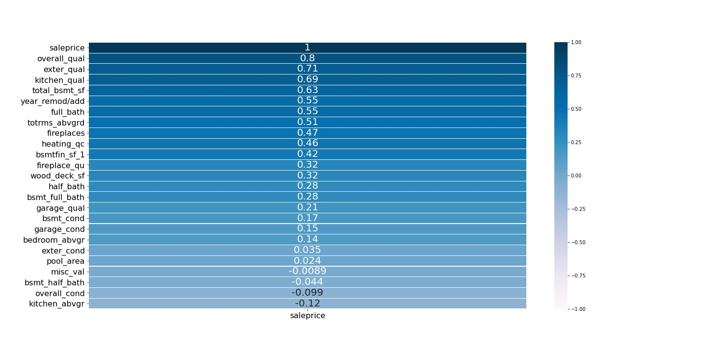

# Predicting House Prices

---

### Background and Problem Statement

The residents of a certain neighborhood in Ames, Iwoa, have decided recently that they would like to sell their properties and move out from the neighborhood in which they currently live. They have contacted us asking for recommendations about how to best prepare to this move, in the sense of what can be done in the home in order to increase its marked value, with the goal of selling it some time in the near future. These recommendations will be based on data about house prices and characteristics that potentially affect them, following an analysis carried out specifially for the purpose of the residents in question.

There is a huge numebr of characteristics, or properties, or things in the house that mighy affect its market value for sale. Some things are intuitively obvious, such as properties related to <ins>space</ins> (a two-story house is worth more than a one-story house; a one-story house of 3000 squared feet is worth more than a one-story house with a square footage of 1500), to <ins>quality</ins> (a low quality kitchen should reduce the house's value, since the new residents would probably have to renovate it) or to <ins>special amenities</ins> (a pool in your back yard is expected to increase the house value).

The goal in this project is to concentrate only on those house properties that can be (relatively) easily approached by the current owners. Again, if the goal is to inform residents about ways to increase their house's value in a relatively short notice, we cannot recommend to them to increase the total square footage of the house, since it'll probably mean they'll have to build an additional section to the house. After we select and analyze the effect of those properties that the current home owners can deal with, we will rank them at look at which ones increase most the value of the house.

The analysis is based on house price data from 2006-2010 in Ames, Iowa, that includes more than 2000 properties and information about them summarized in more than 80 variables. The full data dictionary can be found [here](http://jse.amstat.org/v19n3/decock/DataDocumentation.txt).

---

### <ins>**Step 1:** Selecting the relevant features</ins>

As mentioned above, we first selected all the features that seem to qualify as relevant for our goals. Namely, we picked the features describing house properties that can be manipulated / added / removed / modified by the home owners with relative ease. 

For instance, the quality of the material on the exterior is something that can be redone if deemed important for increasing the house value. Similarly, a central A/C system can be installed. Obviously, the residents will have to see how much resources they are willing to invest in these adjustments in their home, and check whether the effort and money invested in this will be paid off by an increased sale price for their house.

By contrast, we excluded from consideration all the features that describe properties not easily or not at all manipulable by the owners. For instance, the type of zone in which the property is located cannot be affected by the residents. Similarly, it is hard to increase the square footage of the 1st or 2nd floor even if the model indicates it's affects house price a lot. But also the number of stories, although one could in principle add a story to the house, this project is probably much longer and expensie than redoing the external material or improving the kitchen quality, and our residents need a fast and practical solution. 

After selecting the relevant features, we looked at how they correlate with the house's sale price:

All these features were initially included in the analysis, even those who do not correlate strongly with sale price.

---

### <ins>**Step 2:** Dealing with outliers and missing values</ins>

Outliers were identified visually, by inspecting their distributions, and subsequently removed from the data set.

For insance, for the feature 'number of kitchens above ground level', we excluded house conatining 3 kitchens above ground level (excluding the basement).

Similarly, we excluded one house with 8 bedrooms above ground level.

In total, we removed 10 outliers, out of a total of 2044 observations in our data.

As for missing values, in our selected features those meant 'lack of property'. In other words, for the feature 'fence', a missing value means 'no fence'. For the feature 'pool area' a missing value means 'there is no pool'.

Since we are interested in the contribution of this information in terms of predicting house price (that is, whether there is a pool or not, or whether there is a fence or not, might affect house price), we re-coded these missing values and kept them in the data.

---

### <ins>**Step 3:** Preparing the features</ins>

We treated separately **categorical** and **numeric** features. 

**Categorical features** - We coded all of them using [Backward Difference Coding](https://contrib.scikit-learn.org/category_encoders/backward_difference.html) (from Python's 'category_encoder' module).

With this type of encoding, each category (or level) in the feature is compared to the previous one, meaning that for a feature with K categories there will be K-1 comparisons (as required with any type of categorical feature encoding).

Prior to applying the encoding system, we checked and eventually re-ordered the categories within each feature. 

For example, a feature like 'basement condition' contains the following categories: 'no_basement', '1', '2', '3', '4' and '5', where the values from 1-5 represent a rating scale for the condition of the basement (1 being worst, and 5 being best) and 'no_basement' stands for houses that do not have a basement. 

In this case, the Backward Difference Encoding was applied for that given order of the feature categories, such that we have the following 5 comparisons:

1 - no_basement

2 - 1

3 - 2

4 - 3

5 - 4

This is equivalent to taking the numeric scale 1-5 and test its linear relationship with the target variable. But in this feature (and in several others in our data set) we also have the 'no_basement' category, and coding it as 0 would mean it has a zero condition quality, which does not represent properly the data (there is in reality no basement condition for that observation, because there is no basement). On ther other hand, coding it as NA and excluding it from the model would mean we lose information about whether or not the existence of a basement affects sale price.

Note that the Backward Difference Coding is particularly suitable for features with an inherent meaning for the way their values or categories are in. In the coefficient interpreation process, we can have a sense of the increasing (or decreasing) effect of the feature on the target variable, as we move from one feature category to the next.

**Numeric features** - The numeric features were standardized with scikit-learn's StandardScaler transformer, which transform a numeric feature into a z-score. This puts all the numeric variables on a similar scale, which is particularly important when different features are on highly different scales (for instance, number of bedrooms above ground can be between 0 and 6, whereas total square footage can be between 500 and 3000 or so square feet).

---

### <ins>**Step 4:** Modeling</ins>

We split the data into a **train** set (with 2/3 of the data) and a **test** set (with the remaining 1/3 of the data).

**<ins>Baseline model:</ins>**

|Part of the data|RMSE|R2 score|
|---|---|---|
|Training set|181086|-4.05|
|Testing set|181701|-4.66|

**<ins>First model - Linear Regression:</ins>**

The first model included all the 31 features that were selected (after cleaning and scaling / contrast coding them), resulting in 70 slope coefficient parameters to be estimated by the model. 

|Part of the data|RMSE|R2 score|Mean 5-fold Cross Validation Score|
|---|---|---|---|
|Training set|868329764|0.87|-|
|Testing set|948793045|0.84|-|
|Entire set|-|-|-1.876967246137614e+20|

As can be seen, the linear regression model has high variance and in the cross validation process it gets on average a very low R2 score. 

**<ins>Second model - Ridge Regression:</ins>**

In an attempt to obtain better model results (increased $R^2$ score and decreased error, or RMSE), we fit a 5-fold Cross-Validation Ridge Regression model. 

|Part of the data|RMSE|R2 score|
|---|---|---|
|Training set|29398|0.87|
|Testing set|30628|0.84|

This model already performs better, but we still want to reduce its variance.

**<ins>Third model - Lasso Regression:</ins>**

Next, we tried a Lasso regression model in an attempt to reduce the model's variance. In Lasso Regression, the coefficients of the features that do not contribute much to the model will be zeroed out. 

|Part of the data|RMSE|R2 score|
|---|---|---|
|Training set|29033|0.87|
|Testing set|30513|0.84|

This Lasso Regression model did not perform particularly better than the Ridge Regression model. 

In a subsequent step, we dropped some of the features from the model. First, we dropped one feature ('garage quality') that was zeroed out in the Lasso Regression. Moreover, we re-assessed the features included in the model and came to the conclusion that some of them were redundant (meaning, we inlcuded two features that contained similar information), while other still were not suitable for inclusion in the model because of our initial selection creterion of working only with features of house properties that can be modified / dealt with by the owners. 

**<ins>Fourth model - Lasso Regression:</ins>**

In the second Lasso Regression model, we ended up including 50 slope parameter coefficients to be estimated (as compared to 70 in the previous Ridge and Lasso models).

|Part of the data|RMSE|R2 score|
|---|---|---|
|Training set|30488|0.86|
|Testing set|31610|0.83|

This final Lasso Regression model is the one whose coefficients we will interpret and make on the basis of it the recommendations to the residents of Ames. 

---

### <ins>**Step 5:** Interpreting the coefficients and making recommendations</ins>

Below is the table with the coefficients of the final model:

|coefficient|estimate|
|---|---|
|basement_condition 2-1|62,076|
|total_basement_sf|25,781|
|pool yes-no|24,045|
|overall quality of the house|18,259|
|fireplace quality 4-3|16,510|
|number of rooms above ground level|15,794|
|garage condition 4-3|13,098|
|electrical system FuseP-FuseF|12,336|
|quality of material on exterior|10,269|
|kitchen quality|10,078|
|number of fireplaces|10,027|
|numbef of half bathrooms|8,811|
|fence GoodPrivacy-MinimalPrivacy|8,461|
|number of full bathrooms in basement|8,234|
|garage condition 5-4|7,360|
|number of full bathrooms|7,247|
|bsmt condition 1-no_basement|7,220|
|electrical system FuseA-SBrkr|5,845|
|garage interior finish Rough-Unfinished|5,096|
|fence MinimalPrivacy-GoodWoood|5,093|
|garage condition 3-2|4,479|
|overall condition of the house|4,414|
|garage interior finish Unfinished-no_garage|3,114|
|central A/C yes-no|2,952|
|wood deck area|2,798|
|fireplace quality 2-1|2,044|
|garage condition 1-no_garage|1,873|
|number of half bathrooms in basement|1,544|
|heating quality|1,176|
|fireplace quality 3-2|1,083|
|condition of material on exterior|296|
|remodel year|249|
|paved driveway Paved-Partial|149|
|garage interior finish Finished-Rough|-425|
|fence MinimalWood-no_fence|-585|
|number of bedrooms above ground level|-2,061|
|electrical system FuseF-FuseA|-2,659|
|heating system Gravity-GasWarmWaterSteam|-3,365|
|paved driveway Partial-Unpaved|-4,071|
|fence GoodWood-MinimalWood|-5,224|
|heating system GasWater-GasAir|-7,732|
|number of kitchens above ground level|-7,890|
|fireplace quality 1-no_fireplace|-9,282|
|garage condition 2-1|-9,501|
|fireplace quality 5-4|-34,777|
|bsmt condition 3-2|-66,707|

The coefficients in the table represent the increase (or decrease, if they are negative) in house sale price for each 'increase' in the measuring unit of the respective feature. Take for instance a numeric feature like the rating the condition of the material on the exterior: for each increase in this rating (from 1 to 2, from 2 to 3, and so on) the house price is expected to increase by 296 USD, all other features held constant. Now, take as another example the categorical feature 'basement condition' and within it the comparison between the second and the first rating point (2-1). The coefficient for this feature comparison means that, all else held constant, with an increase between condition level 1 and condition level 2 we can expect an increase in house price of 62,000 USD. 

The table is sorted with the order of the estimated coefficients, with the ones predicted to increase most house price placed at the top, and the ones predicted to decrease most house prices place at the bottom. 

Sorted this way (rather than in the more obvious manner of putting all comparisons of a particular feature together), it is easy to advise the residents about the action to take, based on the predicted increase / decrease in house price. For example, having a pool in the back yard is predicted to increase the house price by 24,000 USD. But installing a pool is expensive. A home owner willing to invest in pool installation can thus be informed about the expected rise in house price, compare it to the spending amount and see whether it is worth investing in installing a pool. 

Another example: having a wood deck and increasing its surface is expected to increase house price by 2800 USD, and installing a central A/C system is expected to increase it by 2950 USD. If a home owner cannot afford to install a swimming pool, but could for instance install these amenities relatively cheaply, it might well be worth investing in these small projects and increase the value of the house by smaller amounts, rather than not increasing it at all. 

---

### Conclusions

To summarize our recommendations, we propose different solutions for different cases, based on how much the owners are able to invest in projects towards improvement of their homes. Big projects like renovating and extending the basement, installing fireplaces of good quality, having a big number of rooms above the ground level, improving the garage condition or the kithcen's quality, are expected to yield the biggest increase in house prices. 

But not everyone is capable of carrying out such big projects. In that case, our model suggests that the house value could rise also thanks to smaller improvement projects, such as installing a central A/C system, building a big wood deck at the back yard, having a small bathroom in the basement or improving the quality of the heating system. 

### Next steps

The model on which our recommendations are based is by no means conclusive. It would be necessary to try out different approaches to further decrease its variance so as to make sure that it generalizes well to new, unseen data. Moreover, the addition or removal of features from the model is likely to change (either increase or decrease) the performance and predicting power of the model. 

---